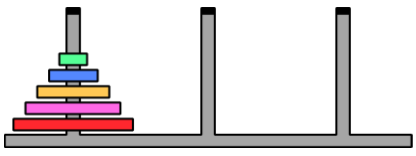

# Torre de Hanoi - Búsqueda A* con heurística propia

**Inteligencia Artificial - CEIA - FIUBA**
**Ejercicio Módulo 2**

## Descripción

Este repositorio resuelve el problema de la **Torre de Hanoi** (5 discos, 3 varillas) utilizando el algoritmo de búsqueda **A\*** con una heurística propia, como alternativa a la Búsqueda Primero en Anchura (BFS) vista en clase.

El objetivo es encontrar la secuencia óptima de movimientos que traslada todos los discos desde la varilla 1 hasta la varilla 3, respetando la regla de que nunca puede colocarse un disco más grande sobre uno más chico.

## Archivos

| Archivo | Descripción |
|---|---|
| `exercise_2_azar.ipynb` | Notebook con la implementación de A* y la heurística |
| `aima_libs/` | Librería base de la cátedra (estados, nodos y problema de Hanoi) |

## Algoritmo implementado

Se implementó **Búsqueda A\*** (`f(n) = g(n) + h(n)`), donde:

- `g(n)`: costo real acumulado desde el estado inicial hasta el nodo `n` (1 punto por cada movimiento).
- `h(n)`: heurística que estima cuántos movimientos faltan (ver abajo).

### Heurística propia

`h(n)` cuenta cuántos discos **todavía no están bien ubicados** en la varilla destino (varilla 3), contando desde la base hacia arriba:

1. Se compara la varilla 3 del estado actual con la varilla 3 del estado objetivo, disco por disco, empezando desde la base.
2. Se cuenta cuántos discos coinciden de forma consecutiva desde la base (`discos_bien_ubicados`).
3. En cuanto aparece el primer disco que no coincide, se deja de contar: ese disco (y todos los que faltan acomodar) van a tener que moverse sí o sí.

```
h(n) = cantidad_total_de_discos - discos_bien_ubicados
```

**Ejemplos** (con 5 discos):

| Situación | `h(n)` |
|---|---|
| Estado inicial (ningún disco en la varilla destino) | 5 |
| Los 3 discos más grandes ya apilados correctamente en la varilla destino | 2 |
| Estado objetivo (los 5 discos en la varilla destino, en orden) | 0 |

Es una heurística simple, fácil de calcular y de entender, que guía la búsqueda hacia estados donde la base de la torre destino ya está armada correctamente.

## Estructura de datos usada

La frontera se implementó con **`heapq`** (min-heap de la biblioteca estándar de Python), donde cada elemento es una tupla:

```python
(f(n), contador, nodo)
```

El `contador` (generado con `itertools.count()`) actúa como desempatador cuando dos nodos tienen el mismo `f(n)`, evitando así comparar directamente objetos `NodeHanoi`.

## Resultados obtenidos (5 discos)

| Métrica | Valor |
|---|---|
| `solution_found` | `True` |
| `nodes_explored` | 169 |
| `states_visited` | 169 |
| `nodes_in_frontier` | 18 |
| `max_depth` | 31 |
| `cost_total` | 31.0 |

El costo total (31 movimientos) coincide con el óptimo teórico para 5 discos ($2^5 - 1 = 31$), confirmando que la heurística guía correctamente al algoritmo hacia la solución óptima. Además, en comparación con BFS (que explora 1351 nodos para el mismo problema), A* con esta heurística explora significativamente menos nodos (169).

## Cómo ejecutar

### En Google Colab

En la primera celda del notebook, antes de cualquier import, ejecutar:

```python
!git clone https://github.com/FIUBA-Posgrado-Inteligencia-Artificial/intro_ia.git
%cd intro_ia/clase2/content/hanoi_tower
```

Esto descarga la librería `aima_libs` necesaria para correr el notebook. Luego, subir o pegar el contenido de `exercise_2_azar.ipynb` en esa misma sesión y ejecutar las celdas en orden.

### En entorno local

1. Clonar este repositorio.
2. Asegurarse de que la carpeta `aima_libs/` esté en el mismo directorio que `exercise_2.ipynb`.
3. Abrir el notebook con Jupyter y ejecutar las celdas en orden:
   ```bash
   jupyter notebook exercise_2_azar.ipynb
   ```

## Autor

**Miguel Augusto Azar**

