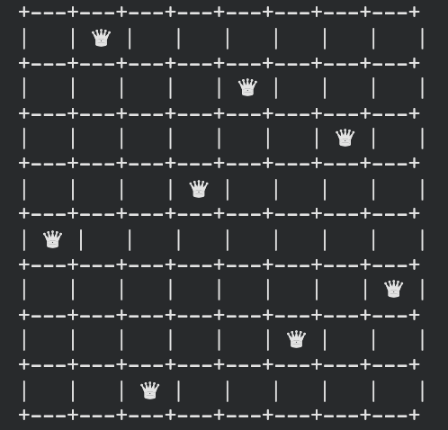

# N Reinas con Simulated Annealing



**Inteligencia Artificial - CEIA - FIUBA**
**Ejercicio Módulo 3**

## Descripción

Este repositorio resuelve el problema de las **N reinas** (tablero de 8x8) utilizando dos algoritmos de **búsqueda local**: **Gradiente Descendente Discreto (Hill Climbing)** y **Simulated Annealing**, implementado este último como parte del ejercicio.

El objetivo es encontrar una configuración de N reinas sobre el tablero tal que ninguna reina ataque a otra (ni por fila, ni por columna, ni por diagonal).

## Archivos

| Archivo | Descripción |
|---|---|
| `N_queens_as_azar_v01.ipynb` | Notebook con la representación del problema, generación de vecinos, función de costo, visualización del tablero, e implementación de Hill Climbing y Simulated Annealing |

## Algoritmos implementados

### Hill Climbing (provisto por la cátedra)

Parte de un estado inicial aleatorio y en cada paso se mueve al **mejor vecino** (el de menor costo). Si ningún vecino mejora el estado actual, el algoritmo se detiene, quedando eventualmente atrapado en mínimos locales.

### Simulated Annealing (implementado en este ejercicio)

Mejora la búsqueda local evitando quedar atrapado en mínimos locales, permitiendo ocasionalmente moverse a un estado peor. En cada iteración:

1. Se elige un vecino al azar (no necesariamente el mejor, a diferencia de Hill Climbing).
2. Si el vecino es mejor (`delta < 0`), siempre se acepta.
3. Si el vecino es igual o peor, se acepta con probabilidad `exp(-delta / temperatura)` .
4. La temperatura se enfría en cada paso: `temperature *= cooling_rate`.
5. El algoritmo corta si se alcanza el costo 0 (solución) o si la temperatura queda prácticamente congelada.

## Representación del problema y función de costo

- **Estado**: lista de tamaño N donde el índice representa la columna y el valor representa la fila donde está ubicada la reina en esa columna.
- **Vecinos**: mover una reina de una columna a una fila distinta dentro de esa misma columna.
- **Función de costo**: cuenta la cantidad de pares de reinas que se atacan entre sí (misma fila o misma diagonal; la misma columna nunca se repite por construcción del estado).

```
costo(estado) = cantidad de pares de reinas en conflicto
```

Un costo de 0 significa que se encontró una solución válida.

## Hiperparámetros de Simulated Annealing

Los valores de `initial_temp` y `cooling_rate` se eligieron mediante una búsqueda empírica (sobre distintas combinaciones, midiendo tasa de éxito en 50-100 corridas por combinación):

| Parámetro | Valor usado | Justificación |
|---|---|---|
| `initial_temp` | `1.0` | Con temperaturas mucho más altas (ej. 100), el algoritmo acepta casi cualquier vecino peor y no logra converger en 1000 pasos. |
| `cooling_rate` | `0.985` | Calibrado contra `max_steps=1000`: `1.0 * 0.985^1000 ` (prácticamente congelado al final), pero manteniendo temperatura útil (`≈0.01`) durante varios cientos de pasos, dejo margen para escapar de mínimos locales antes de convertirse en hill climbing puro hacia el final. |

## Resultados obtenidos (N=8)

### Hill Climbing

| Métrica | Valor |
|---|---|
| Ejecuciones realizadas | 5 |
| Ejecuciones que llegaron a solución (costo 0) | 1 |

### Simulated Annealing

| Métrica | Valor |
|---|---|
| Ejecuciones realizadas | 5 |
| Ejecuciones que llegaron a solución (costo 0) | 5 |
| `initial_temp` | 1.0 |
| `cooling_rate` | 0.985 |
| `max_steps` | 1000 |

En una búsqueda empírica más amplia (100 corridas) con estos mismos hiperparámetros, la tasa de éxito ronda el **85%**, frente al comportamiento de Hill Climbing, que queda atrapado en mínimos locales con más frecuencia al no poder aceptar nunca un movimiento que empeore el estado actual.

## Cómo ejecutar

### En Google Colab / entorno local

1. Abrir el notebook `N_queens_as_azar_v01.ipynb` con Jupyter.
2. Ejecutar las celdas en orden. No se requieren dependencias externas más allá de la biblioteca estándar de Python (`random`, `math`).

```bash
jupyter notebook N_queens_as_azar_v01.ipynb
```

## Autor

**Miguel Augusto Azar**

